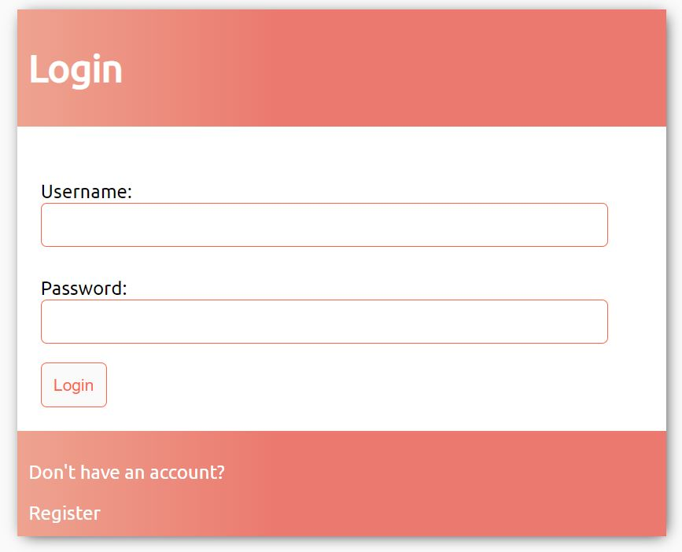
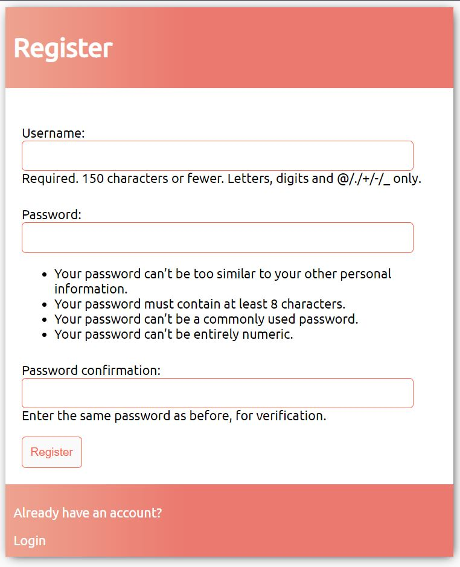
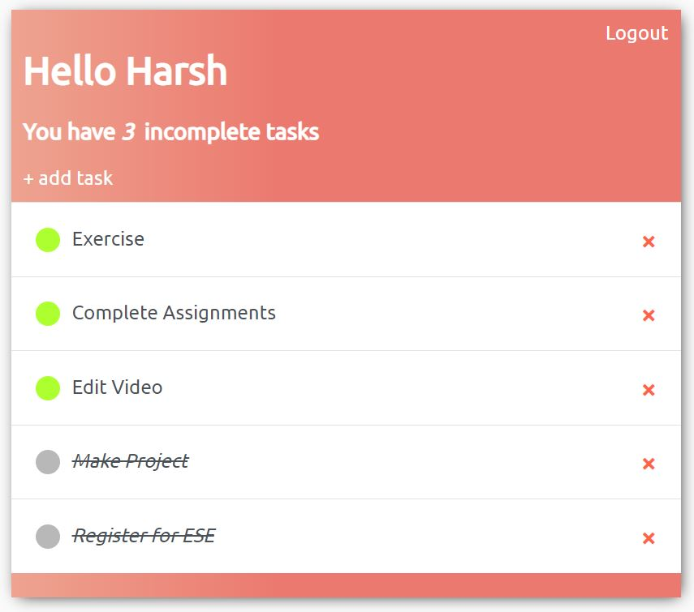
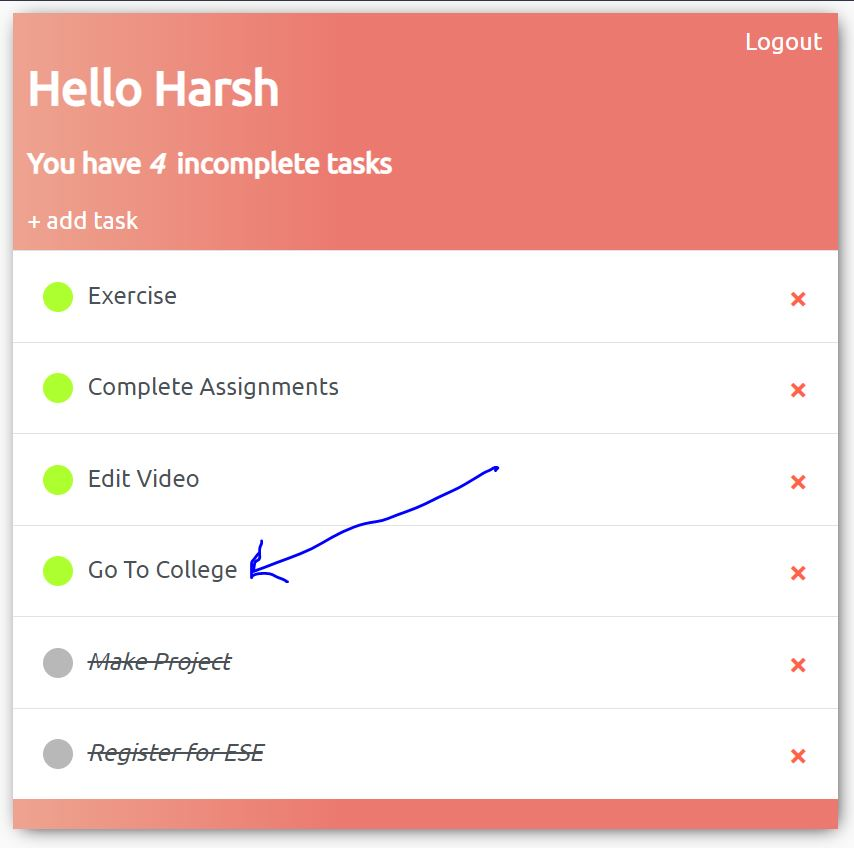

This is a notes making app created using basic html and css for frontend and django web framework at the backend along with sqlite database.  

This project can be set up just like any other django project is.  

When you open the website for the first time you will see the login page.  
  
  

  
Since you dont have any account setup yet you will have to click on the 'register' link at the bottom.
  
  

  
After you register, you will be directed to the main task page which lists all the active and completed tasks. Your list will be empty but the purpose of demonstration I have already populated my list.
  
  

  
To add a new task you will have to click on the 'Add Task' button which is located at the top right below your username.
  
  
![screenshot4][enteringtask.JPG]
  
Now when you return to the main task page you will find you new task has been added.
  
  

As I have demonstrated above you can add a new task. When you click on the task you will be shown the add page again but this time you can update the task. If the task has been completed you can tick the 'completed' checkbox. Completed tasks will be greyed, slanted and stricken off. Now just beside the name of the tas on the main task page is a red 'x' symbol. If you click this symbol, the task entry will be completed deleted after you are asked for a confirmation.
  
Thus you perform all the CRUD (Create Read Update Delete) operations in the project.
  
Thank You for taking your time to read this.  
Best Regards.
